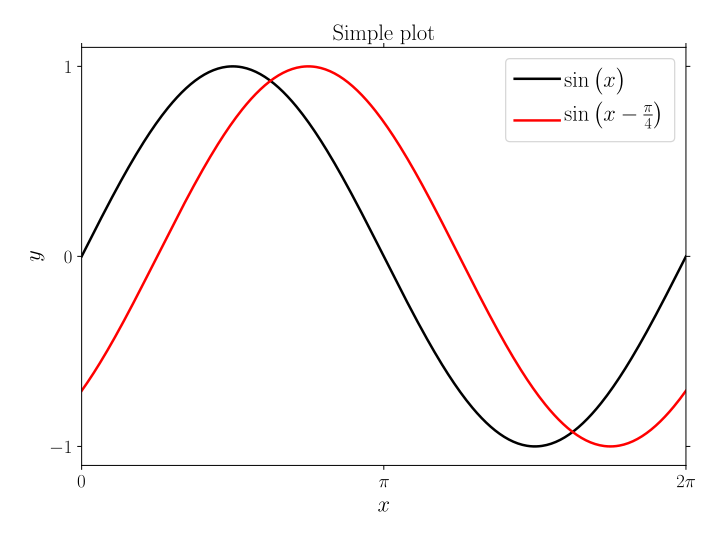
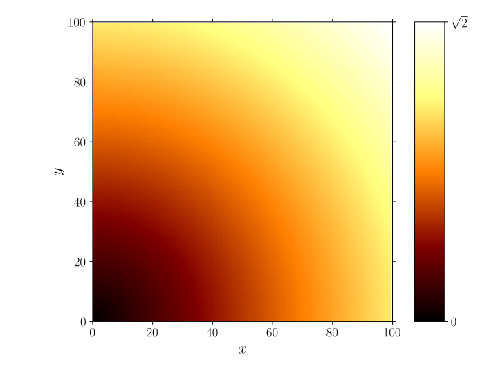

# Outline

<!-- MarkdownTOC -->

- [Customized style](#customized-style)
    - [Overview](#overview)
    - [Tips](#tips)
    - [Examples](#examples)
    - [Extending](#extending)

<!-- /MarkdownTOC -->


# Customized style

## Overview

Matplotlib has a very convenient way to customize plots while minimizing the amount of customized code needed for this. In employs easy-to-switch plotting styles with the same parameters as a `matplotlibrc` file. The only thing needed to switch styles is:

```python
import matplotlib.pyplot as plt
plt.style.use('name_of_custom_style')
```

A number of styles are available. To list them use: `plt.style.available`.

Also, one can use one's own style. This is a text-file `name_of_custom_style.mplstyle` stored in a sub-directory `stylelib` of the Matplotlib configuration directory; e.g.:

```bash
~/.matplotlib/stylelib/         # MacOS/Linux
~/.config/matplotlib/stylelib/  # MacOS/Linux
```

The exact directory depends on the operating system and the installation. To find the directory to use on your system, use:

```python
import matplotlib
matplotlib.get_configdir()
```

Two styles are proposed here: [goose](stylelib/goose.mplstyle) and [goose-latex](stylelib/goose-latex.mplstyle) (see [examples](#examples) below). The styles are equivalent with the exception that latter uses LaTeX and the Computer Modern Roman font.

>   More can be found in the [matplotlib documentation](http://matplotlib.org/users/customizing.html)

## Tips

### Combining styles

Combining different styles is easily accomplished by including a list of styles. For example:

```python
plt.style.use(['dark_background','presentation'])
```

### Temporary styling

To compose parts of the plot with a different style use:

```python
with plt.style.context(('presentation')):
    plt.plot(np.sin(np.linspace(0, 2 * np.pi)))
```

## Examples

### Plot

```python
import numpy as np
import matplotlib.pyplot as plt
plt.style.use('goose-latex')

x = np.linspace(0,2*np.pi,400)

fig,ax = plt.subplots()

ax.plot(x,np.sin(x)         ,label=r'$\sin \big( x \big)$')
ax.plot(x,np.sin(x-np.pi/4.),label=r'$\sin \big( x - \tfrac{\pi}{4} \big)$')

ax.set_title('Simple plot')

ax.xaxis.set_ticklabels(['0',r'$\pi$',r'$2\pi$'])
ax.xaxis.set_ticks([0,np.pi,2*np.pi])
ax.yaxis.set_ticks([-1,0,1])

plt.legend(loc='upper right')

plt.xlim([0,2*np.pi])

plt.xlabel(r'$x$')
plt.ylabel(r'$y$')

plt.savefig('plot_goose-latex.svg')
```



### Image

```python
import numpy as np
import matplotlib.pyplot as plt
plt.style.use('goose-latex')

x,y = np.meshgrid(np.linspace(0,1,100),np.linspace(0,1,100))
d   = np.sqrt(x**2+y**2)

fig,ax = plt.subplots()

cax = ax.imshow(d)

cbar = fig.colorbar(cax,aspect=10)
cbar.set_ticks([0,np.sqrt(2.)])
cbar.set_ticklabels(['0',r'$\sqrt{2}$'])  # vertically oriented colorbar

ax.xaxis.set_ticks(range(0,101,20))
ax.yaxis.set_ticks(range(0,101,20))

plt.savefig('image_goose-latex.svg')
```



## Extending

To get the available fields do the following:

```python
import matplotlib as mpl

print(mpl.rcParams)
```
