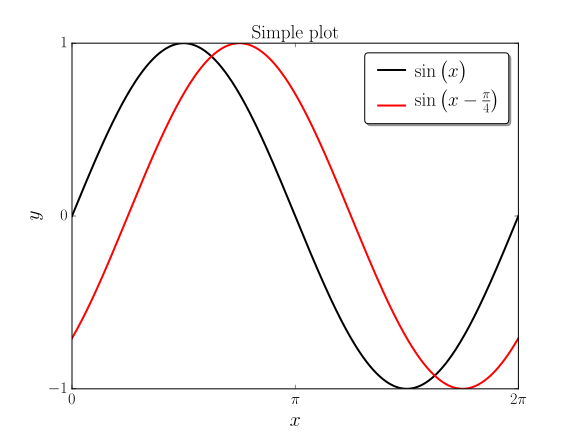

# Customized style

## Examples

### Plot

```python
import numpy as np
import matplotlib.pyplot as plt
plt.style.use('goose_latex')

x = np.linspace(0,2*np.pi,400)

fig,ax = plt.subplots()

ax.plot(x,np.sin(x)         ,label=r'$\sin \big( x \big)$')
ax.plot(x,np.sin(x-np.pi/4.),label=r'$\sin \big( x - \tfrac{\pi}{4} \big)$')

ax.set_title('Simple plot')

ax.xaxis.set_ticklabels(['0',r'$\pi$',r'$2\pi$'])
ax.xaxis.set_ticks([0,np.pi,2*np.pi])
ax.yaxis.set_ticks([-1,0,1])

plt.legend(loc='upper right')

plt.xlim([0,2*np.pi])

plt.xlabel(r'$x$')
plt.ylabel(r'$y$')

plt.savefig('plot_goose_latex.svg')
```



### Image

```python
import numpy as np
import matplotlib.pyplot as plt
plt.style.use('goose_latex')

x,y = np.meshgrid(np.linspace(0,1,100),np.linspace(0,1,100))
d   = np.sqrt(x**2+y**2)

fig,ax = plt.subplots()

cax = ax.imshow(d)

cbar = fig.colorbar(cax,aspect=10)
cbar.set_ticks([0,np.sqrt(2.)])
cbar.set_ticklabels(['0',r'$\sqrt{2}$'])  # vertically oriented colorbar

ax.xaxis.set_ticks(range(0,101,20))
ax.yaxis.set_ticks(range(0,101,20))

plt.savefig('image_goose_latex.svg')
```


## Extending

To get the available fields do the following:

```python
import matplotlib as mpl

print(mpl.rcParams)
```
