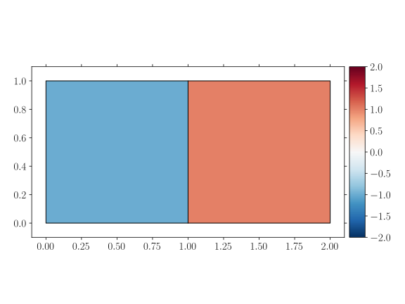
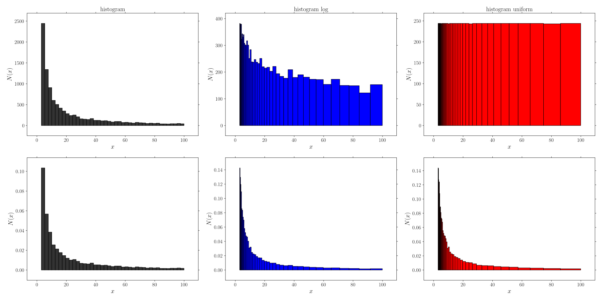
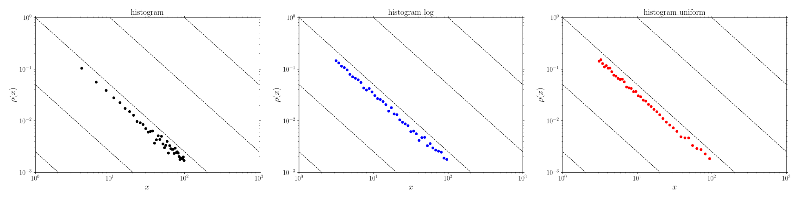
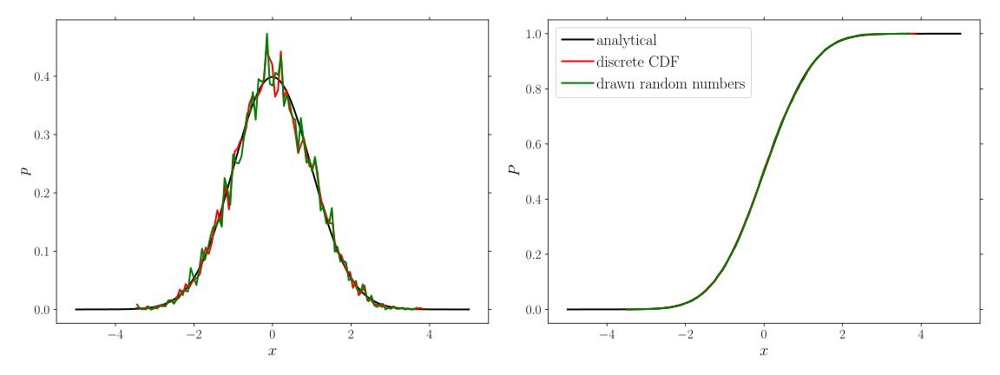
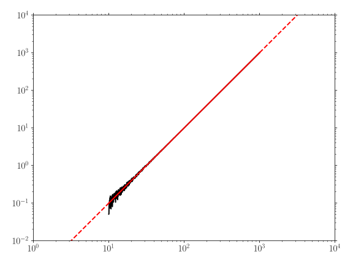

*******************
Examples - GooseMPL
*******************

Patch: plot finite element mesh
===============================

[:download:`source: patch.py <patch.py>`]

.. literalinclude:: patch.py
   :language: python

Histogram
=========

Histogram
---------

[:download:`source: histogram.py <histogram.py>`]

.. literalinclude:: histogram.py
   :language: python

Probability density
-------------------

[:download:`source: histogram_powerlaw.py <histogram_powerlaw.py>`]

.. literalinclude:: histogram_powerlaw.py
   :language: python

Random number of discrete CDF
-----------------------------

[:download:`source: random_from_cdf.py <random_from_cdf.py>`]

.. literalinclude:: random_from_cdf.py
   :language: python

Log-scale
=========

Ticks
-----

[:download:`source: ticks_log.py <ticks_log.py>`]

.. literalinclude:: ticks_log.py
   :language: python

Fitting
=======

Powerlaw
--------

[:download:`source: fit_powerlaw.py <fit_powerlaw.py>`]

.. literalinclude:: fit_powerlaw.py
   :language: python
