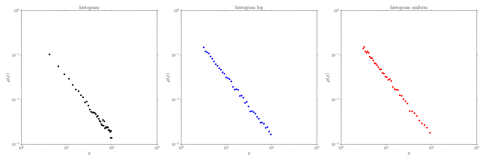

*******************
Examples - GooseMPL
*******************

Patch: plot finite element mesh
===============================

[:download:`source: patch.py <patch.py>`]

.. literalinclude:: patch.py
   :language: python

.. image:: patch.svg
  :width: 800px
  :align: center

Histogram of a power-law
========================

[:download:`source: histrogram_powerlaw.py <histrogram_powerlaw.py>`]

.. literalinclude:: histrogram_powerlaw.py
   :language: python

