.. _examples-pyplot:

********
Examples
********

Plot
====

Basic
-----

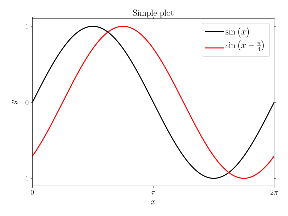

:download:`source: plot.py <plot.py>`

.. literalinclude:: plot.py
   :language: python

Subplot
-------

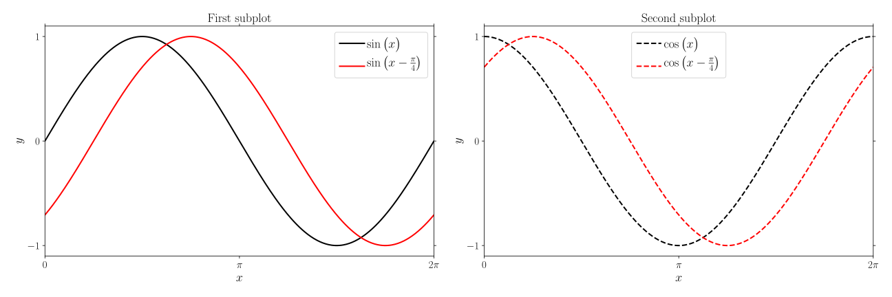

:download:`source: subplot.py <subplot.py>`

.. literalinclude:: subplot.py
   :language: python

Legend
------

Set background colour
^^^^^^^^^^^^^^^^^^^^^

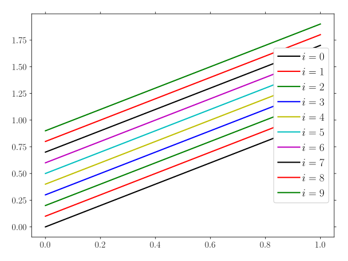

:download:`source: legend_background.py <legend_background.py>`

.. literalinclude:: legend_background.py
   :language: python

Move legend outside the plot
^^^^^^^^^^^^^^^^^^^^^^^^^^^^

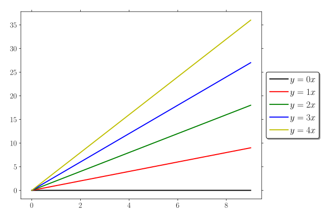

.. note:: References

  `StackOverflow - "How to put the legend out of matplotlib plot" <https://stackoverflow.com/a/4701285/2646505>`_

:download:`source: legend_external.py <legend_external.py>`

.. literalinclude:: legend_external.py
   :language: python

Line-color from colormap
------------------------

With colorbar
^^^^^^^^^^^^^

:download:`source: plot-cmap.py <plot-cmap.py>`

.. note:: References

  `StackOverflow - "Matplotlib: Add colorbar to non-mappable object" <http://stackoverflow.com/questions/43805821/matplotlib-add-colorbar-to-non-mappable-object/43807666#43807666>`_

.. note::

  This example features a colorbar where the 'ticks' are placed in the middle of the color blocks. Should you be interested in something simpler, you could also use:

  .. code-block:: python

    sm = plt.cm.ScalarMappable(cmap=cmap, norm=mpl.colors.Normalize(vmin=0,vmax=2))
    sm.set_array([])

    cbar = fig.colorbar(sm)
    cbar.set_ticks(...)
    cbar.set_ticklabels(...)

.. literalinclude:: plot-cmap.py
   :language: python

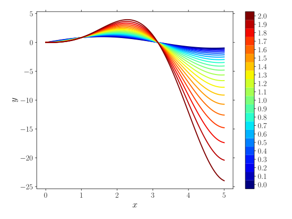

Using cycler
^^^^^^^^^^^^

:download:`source: plot-cycler.py <plot-cycler.py>`

.. note:: References

  `matplotlib - "Styling with cycler" <https://matplotlib.org/3.2.1/tutorials/intermediate/color_cycle.html>`_

.. note::

  The cycler can also be used to cycle through line-styles. E.g.

  .. code-block:: python

    custom_cycler = (cycler(color=['r', 'g', 'b', 'y']) +
                     cycler(linestyle=['-', '--', ':', '-.']))

.. literalinclude:: plot-cycler.py
   :language: python

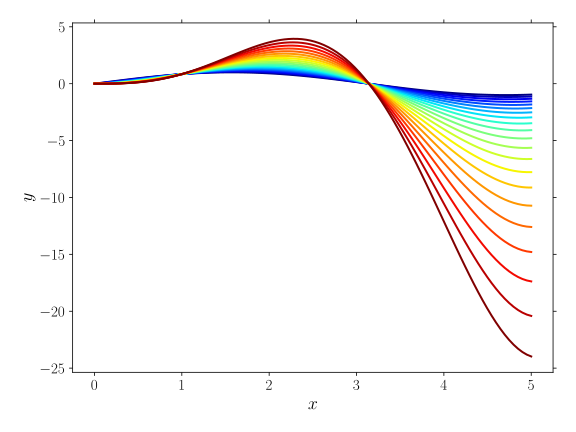

Multi-colour line
^^^^^^^^^^^^^^^^^

:download:`source: multicolor.py <multicolor.py>`

.. note:: References

  `StackOverflow <https://stackoverflow.com/a/59131436/2646505>`__

.. literalinclude:: multicolor.py
   :language: python

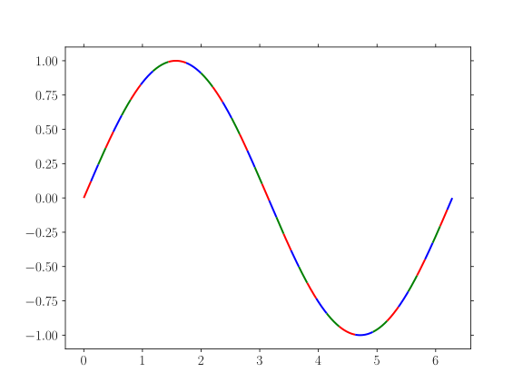

Ticks
-----

Aligning tick labels
^^^^^^^^^^^^^^^^^^^^

:download:`source: tick-position.py <tick-position.py>`

This example is just a copy of `this nice answer <https://stackoverflow.com/a/47500319/2646505>`_. See also `the blog <https://gorelik.net/2017/11/23/how-to-make-a-graph-less-readable-rotate-the-text-labels/>`_ of the author.

.. note::

  Also take note of:

  .. code-block:: python

    ax.set_xticklabels(xlabels, ha='center')
    ax.set_yticklabels(ylabels, va='center')

.. literalinclude:: tick-position.py
   :language: python

Tick formatter
^^^^^^^^^^^^^^

:download:`source: tick-formatter.py <tick-formatter.py>`

.. note:: References

  * `matplotlib.ticker <https://matplotlib.org/api/ticker_api.html#matplotlib.ticker.StrMethodFormatter>`_

  * `Format Specification Mini-Language <https://docs.python.org/3/library/string.html#formatspec>`_

.. note::

  Use ``matplotlib.ticker.FormatStrFormatter(...)`` to use the old-style sprintf format.

.. literalinclude:: tick-formatter.py
   :language: python

Logarithmic scale
^^^^^^^^^^^^^^^^^

Tick rotation
"""""""""""""

:download:`source: tick-rotation-log.py <tick-rotation-log.py>`

.. literalinclude:: tick-rotation-log.py
   :language: python

Specifying ticks
""""""""""""""""

:download:`source: tick-log_1.py <tick-log_1.py>`

.. literalinclude:: tick-log_1.py
   :language: python

Selecting ticks
"""""""""""""""

:download:`source: tick-log_2.py <tick-log_2.py>`

.. note:: References

  * `Selectively remove ticklabels (major and/or minor) from logarithmic axis <https://stackoverflow.com/a/55691264/2646505>`_

To have ticks at multiples of 1 and 2 of integer powers of the logarithmic base (10) use
``matplotlib.ticker.LogLocator(subs=(1,2,))``.
Then use ``matplotlib.ticker.NullLocator()`` to turn minor labels off.

.. literalinclude:: tick-log_2.py
   :language: python

Image
=====

:download:`source: image.py <image.py>`

.. literalinclude:: image.py
   :language: python

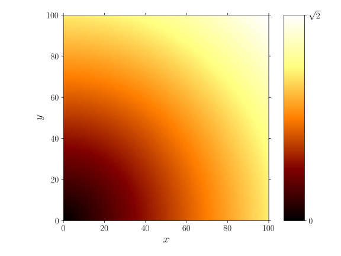

Colorbar
========

Basic
-----

:download:`source: image_subplots.py <image_subplots.py>`

.. literalinclude:: image_subplots.py
   :language: python

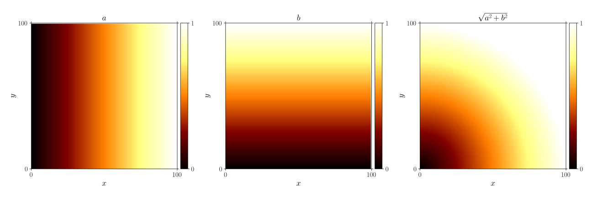

.. note:: References

  * `StackOverflow - "positioning the colorbar" <https://stackoverflow.com/a/43425119/2646505>`_

Colorbar positioning
--------------------

:download:`source: image_subplots_bottom.py <image_subplots_bottom.py>`

.. literalinclude:: image_subplots_bottom.py
   :language: python

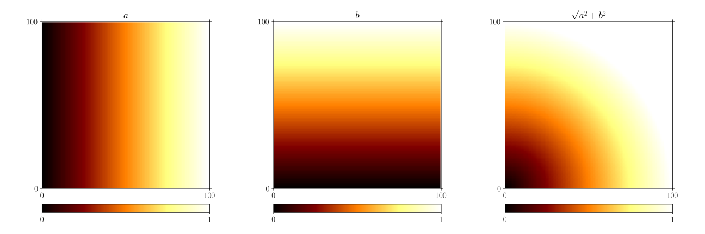

Stand-alone colorbar
--------------------

:download:`source: colorbar.py <colorbar.py>`

.. note:: References

  * `matplotlib documentation - "colorbar_only" <http://matplotlib.org/examples/api/colorbar_only.html>`_

.. literalinclude:: colorbar.py
   :language: python

Colormap
========

Combined colormap
-----------------

:download:`source: colormap.py <colormap.py>`

This example shows how to create a custom colormap. To do this one has to create an RGBA-matrix:
a matrix with on each row the amount (between 0 and 1) of Red, Green, Blue, and Alpha (transparency;
0 means that the pixel does not have any coverage information and is transparent).

As an example the distance to some point is plotted in two dimensions. Then:

* For any distance higher than some critical value, the colors will be taken from a
  standard colormap.
* For any distance lower than some critical value, the colors will linearly go from
  white to the first color of the previously mentioned map.

.. note::

  The choices depend fully on what you want to show. The colormaps and their sizes depend
  on your problem. For example, you can choose different types of interpolation:
  linear, exponential, ...; single- or multi-color colormaps; etc..

.. note::

  The choices depend fully on what you want to show. The colormaps and their sizes depend
  n your problem. For example you can choose a different types of interpolation:
  linear, exponential, ...; single- or multi-color colormaps; etc..

.. literalinclude:: colormap.py
   :language: python

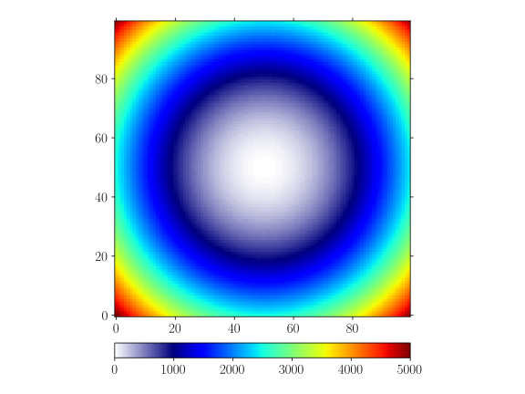

Sub-colormap vs. interpolated colormap
--------------------------------------

:download:`source: colormap-part.py <colormap-part.py>`

This example contains a simple example to derive a custom colormap from an existing colormap,
see `this answer <https://stackoverflow.com/a/51036472/2646505>`_.

.. literalinclude:: colormap-part.py
   :language: python

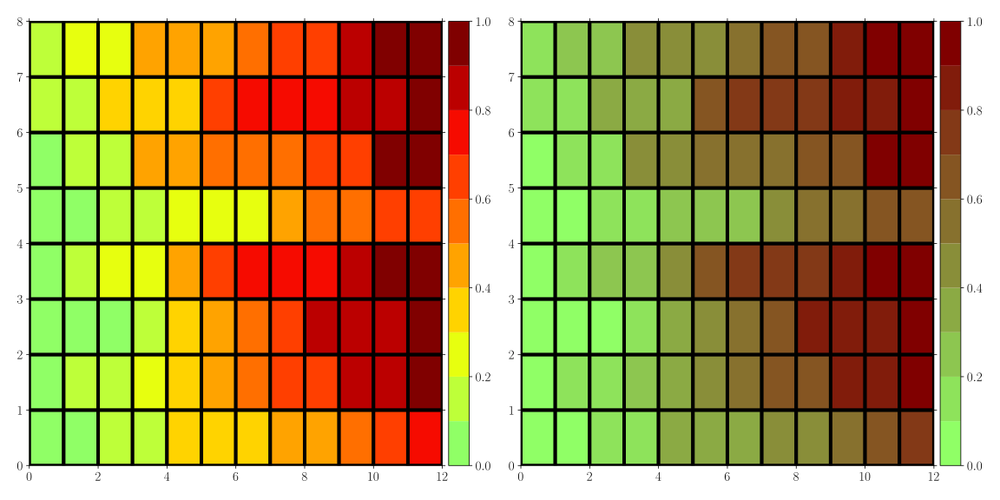
